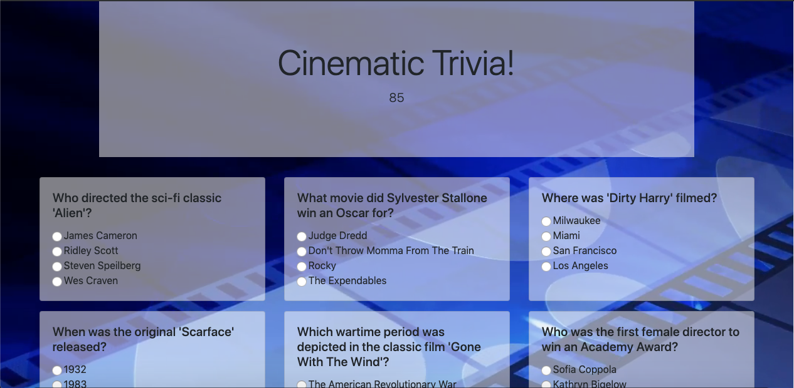

# Cinematic Trivia
___

### Design
The design of Cinematic Trivia made prominent use of JQuery/Bootstrap and use moderate of CSS. A blue background image of a movie reel was formatted to cover and expand with resizing. Then the jumbotrons resized by 75% of their original width and given and semi-transparent background by manipulating the opacity. The cards in card deck were also given a semi-transparent background utilizing the same styling format. The divs associated with gameOverMessage and results were given a text color of white to contrast the default font color of black featured in the jumbotron heading above. A gif image is featured in the middle of the opening page displayed with centering using margins left and right auto and display:block formatting. JQuery was utilized to hide divs and display a variable using setInterval to decrement a timer.

### Logic
The Cinematic Trivia game required the use of JavaScript in order to create the game logic. First I declared an array of objects containing key:value pairs of: question key with a value containing a string phrased as a cinematic trivia question and answers key with the value of another object containing key:value pairs between a-d with values of answer options. JQuery was then utilized to display questions to the DOM on associated div with .text. JQuery's append method enabled me to created a radio concatenated with the array index for each question key value function call that displays question text to card deck/DOM by accessing array at a specific index at the question key for question and the answers key with their respective values. Next, an on-click listener was declared that assigns the value of each radio to a variable. Clicking on the submit button causes the setInterval to be cleared and radio value variables are then saved to an array. I then declared a for loop that iterates through answersArr and checks radio value variables against correctAnswersArr at index i, then increments results variable for each correct answer. The function will subsequently display text in results div telling the user how many questions they answered correctly. A function was then created to log correct answers checked in radios if the timer ran down prior to submission by the user. Next an on.click listener attached to the restart button div creates a series of variable reassignments that removes checks from radios, resets timer to original value, and restarts decrement process when game is restarted. 

## Built With

___

* [HTML](https://developer.mozilla.org/en-US/docs/Web/Guide/HTML/HTML5)
* [CSS](https://developer.mozilla.org/en-US/docs/Web/CSS)
* [JavaScript](https://developer.mozilla.org/en-US/docs/Web/JavaScript/Reference)
* [Bootstrap](https://getbootstrap.com/docs/4.3/getting-started/introduction/)
* [JQuery](https://api.jquery.com/)

___

[Cinematic Trivia Game page](https://djgoldstone.github.io/TriviaGame/)

___

## Authors

* Derek Goldstone - [UC Berkeley Extension](https://www.linkedin.com/in/derek-goldstone-482884a3/)

___